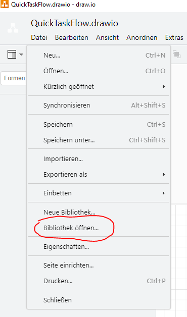
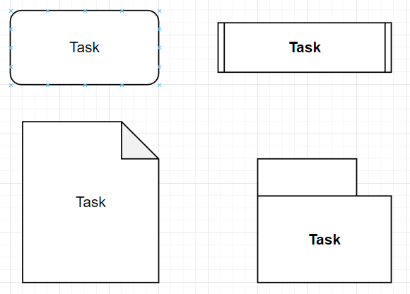
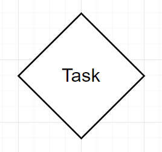

# Dokumentatio der Funktionen von **TaskFlow**

In diesem Teil werden die Bestanteile und Funktionen von 
**TaskFlow** näher beschrieben.

## Laden der Formen Biblothek 

    TaskFlowFormLib.drawio
## Die Formen

**Task**

**Verzweigung**

**Start/End**

******************

## Task_Definitions

    def Print(Objects):

       print(Objects)

    def Input(Objects):

       a=input("a=")

       Objects["in"]=int(a)

## Flow Agent 

    from TaskFlow_QuickFlow import Flow_QuickFlow

    Flow_QuickFlow()

## Konsolen Aufruf

    
    TaskFlowCreator.py Exampel/QuickTaskFlow.drawio QuickFlow