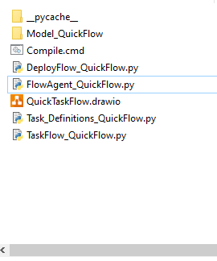

# Dokumentatio der Funktionen von **TaskFlow**

In diesem Teil werden die Bestanteile und Funktionen von 
**TaskFlow** näher beschrieben.

## Formen Biblothek
Die **Formen**, für **TaskFlow**, lassen sich über den folgenden **Befehl** in **Drawio** laden.

Der Name der Biblothek ist :

    TaskFlowFormLib.drawio
  

## Formen

In **TaskFlow** stehen die folgenden Formen zur verfügung :

* **Task**

Auf diesen kann eine Aufgabe , bestehend aus **Buchstaben** und **Zahlen**, definiert werden. Ein Beispiel wäre [HillClimber](KomplexExampel/HillClimber/README.md)

* **Verzweigung**

Hier wird auch eine Aufgabe definiert, aber diese wird mir **True** oder **False** beantowrte.   
Für nähere Informationen siehe Beispiel [DecissionTest](KomplexExampel/DecissionTest/README.md).

**Start/End**
Markiert den Start und Endpunkt eines **Flows** . Jeder **Flow** braucht einen **Start** und **Endpunkt**.

******************
  
# Task_Definitions
Die einzelnen **Task** von jedem **Flow** werden in dem Skript **Task_Definitions** näher beschrieben.
  

Jeder **Block** in dem Diagramm entsprcht einer Funktion. Die Variable **Objects** ist ein **Dictonary** und global. 

    def Task_1(Objects):
        pass

    def Task_2(Objects):
        pass

Ein **Verzweiguns Block** ist hier die Ausnahme, dieser  braucht zwei 
Rückgabewerte **True** und **False**.

    def Decission(Objects):

        if cond:
            return True
        else:
            return False
  

## Konsolen Aufruf
Mit dem Folgenden **Befehl** kann ein **Flow** übersetzt werden.

    
    TaskFlowCreator.py [Name].drawio [Tabname]

Als Parameter wird der Name der **Drawio** Datei benötigt und der des Tabs auf welchem das Diagramm liegt.

## Arbeitszyklus für einen **Flow**

Wir gehen hier davon aus, das bereits einmal der obige **Konsolen befehl** ausgeführt wurde.

Ist das der Fall, wurden, bezogen auf das Beispiel in **Quickstart**, die folgenden **Datein** generiert.

Die einzelnen **Skripte** haben die folgenden bedeutung

* **FlowAgent_QuickFlow.py** : Mit diesem wird der **Flow** gestartet
* **DeployFlow_QuickFlow.py** : Wenn änderungen im **Editor** vorgenommen wurden überträgt dieses **Skript** diese . 
* **Task_Definitions_QuickFlow.py** : Hier werden die einzelnen **Aufgaben** definiert welche im DIiagramm als **Blöcke** dargestellt sind.
* **TaskFlow_QuickFlow.py** : Hier befindet sich der **Algorithmus** für den **Flow** selbst . In der Regel müssen hier keine änderungen vorgenommen werden.

**************

Der Arbeitsablauf für die änderungen am **Flow** ist der folgenden :

1. Den Flow im **Editor** ändern.
2. Das **DeployFlow_QuickFlow.py** ausführen
3. Den Flow  mit **FlowAgent_QuickFlow.py** starten

  

Der Arbeitsablauf für änderungen in **Task_Definitions_QuickFlow.py** ist:

1. **Task_Definitions_QuickFlow.py** ändern
2. Den Flow  mit **FlowAgent_QuickFlow.py** starten