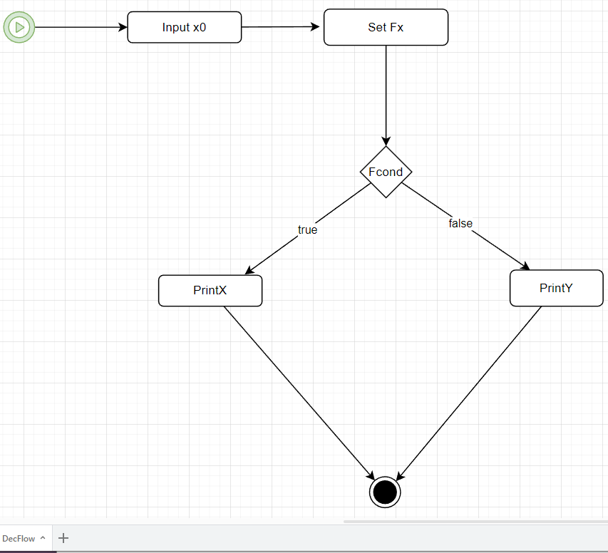

# Decission Flow

Hier wird das folgende Diagramm beschrieben.

In diesem wird zu erst eine Grösse **x0** eingegeben. Dann eine 
Funktion **Fx** definiert und diese in einer **Bedingung** geprüft.
Zum Schluss  wird eine **Ausgabe** gemacht.

## Die Task's

Die einzelnen Task's haben den folgenden **Code** :

    def Inputx0(Objects):

           x0=input("x0= ")
           Objects["x0"]=float(x0)

    def SetFx(Objects):

           Objects["fx"]=lambda x : x**2 
        

    def Fcond(Objects):
       
           x=Objects["x0"]
           y=Objects["fx"](x)
           Objects["y"]=y
       
           if y>=x :
                  return True
           else:
                  return False
       
    def PrintX(Objects):
           print(Objects["x0"])
       

    def PrintY(Objects):
           print(Objects["y"])

  
Besonders hervorzuheben ist hier die Funktion **Fcond(Objects)**, weil diese
eine **Verzweigung** darstellt. Das bedeutet sie hat zwei Ausagaen , **True** dann wird im Diagramm der linke Pfad verwendet und **False** für den rechten Pfad.
    
## Output
Die Ausgabe ist :

    StartFlow

    x0= 2
    2.0

    Flow Complete

