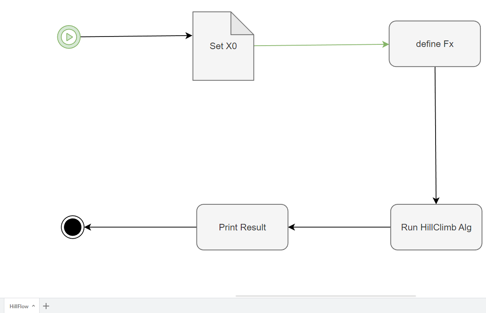

# HillClimbing

In diesem Beispiel wird der folgenden **Flow** beschrieben.

In diesem wird zu erst eine Variable **x0** gesetzt, anschließend 
eine Funktion **Fx** definert und zum Schluss ein Algorithmus
HillClimb ausgeführt.

## Die einzelnen Task's
Die **Task's** haben die folgenden Funktionen.

    def SetX0(Objects):

            x0=input("x0=")

            Objects["x0"]=float(x0)
        

    def defineFx(Objects):

            Objects["Fx"]=lambda x: x**2

        

    def RunHillClimbAlg(Objects):

            x0=Objects["x0"]
            y0=Objects["Fx"](x0)

            Objects["Hill"]=y0+1
       

    def PrintResult(Objects):

            print(Objects["Hill"])

## Output   
Der **Output** des Flows ist :

    StartFlow

    x0=4
    17.0

    Flow Complete