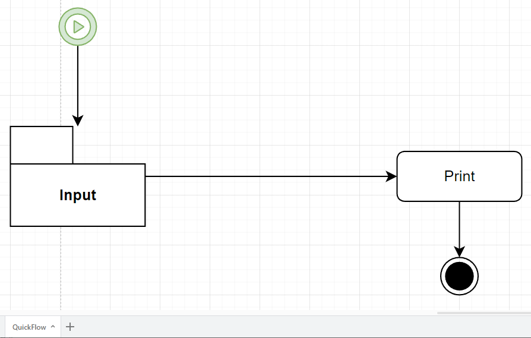

# TaskFlow

In diesem Projekt geht es um das Übersetzen von Abläufen, die als 
Diagramm in **Drawio** vorliegen, in ein Ausführbares **Programmm**. Um die Diagramme darzustellen benutzen wir das Programm **Drawio**.

## Inhaltverzeichniss

1. [Quickstart](##Quickstart)
2. [Funktion Dokumentation](Doc/FucnDoc.md)
3. kommt bald

## Quickstart

Wir beginnen mit dem folgenden **Drawio** Diagramm. 

  

Hier wird einfach über **Input** eine Variabl eingelesen und bei dem Block
**Print** wieder ausgegeben. Der grüne **Block** am Anfang mit dem **Play** Symbol ist der Start des **Flows**. Der schwarze **Kreis** ist das Ende und stoopt den **Flow**.  Jeder **Flow** braucht einen Start und Endpunkt. 

****************************

Der nächste Schritt ist das ausführen des folgeden **Konsolen** befehls.

    TaskFlowCreator.py Exampel/QuickTaskFlow.drawio QuickFlow

Dieser erzeugt die folgeden **Files** in unserem **Verzeichniss** wo das Diagramm liegt.

Die einzelnen **Skripte** haben die folgenden bedeutung

* **FlowAgent_QuickFlow.py** : Mit diesem wird der **Flow** gestartet
* **DeployFlow_QuickFlow.py** : Wenn änderungen im **Editor** vorgenommen wurden überträgt dieses **Skript** diese . 
* **Task_Definitions_QuickFlow.py** : Hier werden die einzelnen **Aufgaben** definiert welche im DIiagramm als **Blöcke** dargestellt sind.
* **TaskFlow_QuickFlow.py** : Hier befindet sich der **Algorithmus** für den **Flow** selbst . In der Regel müssen hier keine änderungen vorgenommen werden.

  

******************************
Der nächste Schritt ist das öffenn des Skriptes **Task_Definitions_QuickFlow.py**. In werden die einzelnen Aufgaben, die im Diagramm als **Blöcke** dargestellt sind näher beschrieben. Wir fügen den folgenden **Code** hinzu.

    def Print(Objects):

       print(Objects)

    def Input(Objects):

       a=input("a=")

       Objects["in"]=int(a)

Wie oben beschrieben wird in der **Funktion Input** eine Variable eingelesen und über die **Funktion Print** ausgegeben. Die Variable **Object**  ist ein **Dictonary** der global über alle Funktionen aggiert.

  
Der **Flow** ist nun Fertig und kann mit dem Aufrufen des Skriptes 
**FlowAgent_QuickFlow.py** ausgeführt werden.

  
**Output**:

    StartFlow

    a=4
    {'in': 4}

    Flow Complete